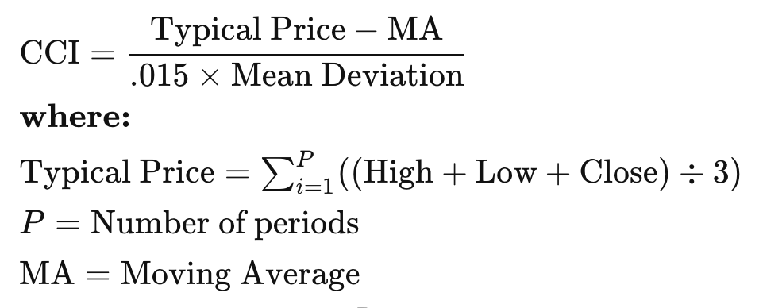
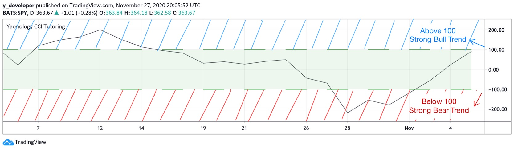
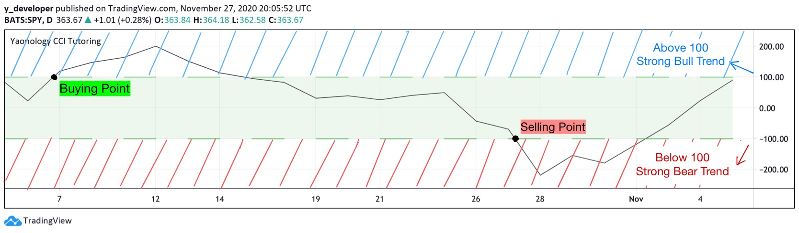

## 1. What is CCI

### The formula for Commodity Channel Index (CCI)

    
    
Commodity Channel Index(CCI) was developed by Donald Lambert, which is a momentum-based oscillator used to help determine when an investment vehicle is reaching a condition of being overbought or oversold lines. It is also used to assess price trend direction and strength. This information allows traders to determine if they want to enter or exit a trade, refrain from taking a trade, or add to an existing position. In this way, the indicator can be used to provide trade signals when it acts in a certain way.

CCI measures the gap between the historical price and current price. Zero level determines how close the current price is approaching to the historical price. High readings above 100 means the current price is way higher than historical price and shows a robusted upward momentum. Low readings below -100 shows the current price is in recession and underperforms than the historical price. 

Going from 0 to positive 100 can be reckoned as an emerging uptrend. 

Going from 0 to negative 100 can be reckoned as an emerging downtrend.

## 2. How to Calculate the Commodity Channel Index (CCI)

1. Determine how many periods your CCI will analyze. 20 is commonly used. Fewer periods results in a choppier indicator, while more periods will make it smoother. For this calculation, we will assume 20 periods. Adjust the calculation if using a different number.

2. In a spreadsheet, track the high, low, close for 20 periods and compute the Average Price.

3. After 20 periods, compute the Moving Average of the typical price by summing the last 20 Typical Prices and dividing by 20.

4. Calculate the Mean Deviation by subtracting the Moving Average from the Average Price for the last 20 periods. Sum the absolute values of these figures and then divide by 20.

5. Insert the most recent Average Price, the Moving Average, and the Mean Deviation into the formula to compute the current CCI reading.

## 3. What does Commodity Channel Index tell you?

CCI is used to spot the new trend, assisting traders to set the overbought and oversold levels. If it moves from negative or near-zero territory to above 100, that may indicate the price is starting a new uptrend. Traders can watch for a pullback in price followed by a rally in both price and the CCI to signal a buying opportunity. Vice versa, Traders can watch for shorting opportunities when the indicator moves from positive or near-zero territory to -100. Compared to other indicators, CCI is an unbounded indicator meaning it can go higher or lower indefinitely. For this reason, overbought and oversold levels are typically determined for each individual asset by looking at historical extreme CCI levels where the price reversed from.

Also, CCI level is not a fixed indicator and it varies among different assets. For different individual assets, traders must check the threshold levels where the stock price gets reversed. 

However, if the stock price moves up and CCI goes down, what should the trader do? It will generate the divergence problem. It actually warns the trader by providing signals of reversal. So, traders would restrain the stop-loss level or conservative about the future trades since they would consider the possibilities of price reversal. 

### Bull/Bear Trend

## 4. Commodity Channel Index Strategy

### Bull/Bear Trend

## 5. Tradingview Pine Script

### · Step One: Initial Setting

    //version = 4
    strategy("Yaonology CCI Tutoring", overlay=false,
    default_qty_type = strategy.percent_of_equity, default_qty_value = 100,
    currency = currency.USD, initial_capital = 10000,
    commission_type = strategy.commission.percent, commission_value = 0)

(1) Step one initial setting is the step we set up the strategy property, which includes “Strategy ID”, “The plot overlays the main chart or show on the separate chart pane. ”, “How much is the initial capital”, “How many percentages of capital buying the equity?”, “How much is commission fee”.

(2) First, we need to set up the Pine Script version. Here, we are using the last version, version four.

(3) Then, we start to code the strategy property. The double quote we type “Yaonology CCI Tutoring”, which is the strategy id.

(4) “overlay equals false” means that the plot will show on the separate chart pane.

(5) Then, we set up the initial capital, here, we code “initial_capital equals 10000” and “currency = currency.USD”, which means that we are using US$10000 as the initial capital.

(6) Then, we need to determine how many shares we trade equities. Here, we code “default_qty_type equals strategy.percent_of_equity” and “default_qty_value equals a hundred”, which means that we are using the percentage type to trade the equity, and we use 100 percent of capital to trade the equities.

(7) Finally, we set up the commission fee. Here, we code “commision_type equals strategy.commission.percent” and “commission_value = 0”, which means that we use the percentage type to calculate the commission fee, and here we set up 0% commission fee because most brokers don’t charge the commission fee currently.

### · Step Two: Parameter Setting

    //Step Two: Parameter Setting
    c = cci(close, 20)

(1) Luckily, TradingView platform offers a implanted function called “cci” that we can use directly to find the CCI indicator.

(2) C equals to cci brackets close comma 20 means we are calculating the CCI indicator based on the stock’s closing price over the 20-day period.

### · Step Three: Plotting

    //Step Three: Plotting
    plot(c, color = color.black)
    p1 = plot(100, color = bar_index % 2 == 0 ? color.green : #00000000)
    p2 = plot(-100, color = bar_index % 2 == 0 ? color.green : #00000000)
    fill(p1, p2, color = color.green)
    
(1) Now let’s plot the CCI line and the buying/selling boundaries.

(2) First, plot brackets c comma color equals color dot black means we are plotting the CCI indicator in black.

(3) The next two lines looks difficult and messy, but they only label the threshold 100 and -100, which are our buying and selling points, in green dotted line.

(4) However, there are two things worth remembering here, which are the usage of percent mark and the combination of two connected equal sign and question mark and colon.

(5) The division sign gives us the remainder. For example, 4 percentage 2 will give us 0 because 4 divided by 2 is 2 and there’s no remainder; 4 percentage 3 will give us 1, because there’s a remainder of 1.

(6) Thus, the percentage sign is often used in if-else structure to check if a number is odd or even.

(7) If a number is even, the number percentage 2 will equal 0; otherwise it won’t.

(8) So what about the question mark and colon here? The combination is a simple way to construct an if-else statement in a single line.

(9) First we have the if statement. Here, our statement is bar slash index percentage 2 double equals to 0. It simply asks whether the variable bar slash index is an even number.

(10) If it is, we execute the statement between the question mark and colon mark; if it is not, we execute the statement after the colon mark.

(11) Combining everything together, we are highlighting the lines y equals 100 and y equals minus 100 with green and white in turn, which creates a final effect of a dotted line.

(12) Finally, we fill the area between 100 and minus 100, which is our holding area, with green color.

### · Step Four: Strategy Entry and Strategy Close

#### i). Bull/Bear Trend

    //Step Four: Strategy Entry and Strategy Close
    if crossover(c, 100)
        strategy.entry(id = "cci")
        
(1) Now let’s finish our buying and selling part.

(2) as discussed before, we buy the stock when we see the CCI indicator moves above 100, which suggests a strong buying trend in the market.

(3) Here, we use the function of crossover to check if CCI moves beyond 100.

(4) On the other hand, we use crossunder function to decide whether CCI indicator is below minus 100, which suggests a strong selling trend.

|  | **Net Profit** | **Precent Profitable** | **Profit Factor** | **Max Drawdown** | 
| --- | --- | ---| --- | --- |
| **CCI Bull/Bear Trend** | 105.07% | 47.33% | 1.348 | 36.67% |

#### ii). Bull/Bear Trend Against Market

    //Step Four: Strategy Entry and Strategy Close
    if crossover(c, -100)
        strategy.entry(id = "cci", long = true)

    if crossover(c, 100)
        strategy.close(id = "cci")
        
|  | **Net Profit** | **Precent Profitable** | **Profit Factor** | **Max Drawdown** | 
| --- | --- | ---| --- | --- |
| **CCI Bull/Bear Trend** | 105.07% | 47.33% | 1.348 | 36.67% |        
| **CCI Bull/Bear Trend Against Market** | 196.02% | 74.81% | 1.745 | 28.35% |

(1) CCI is a trend-following strategy. However, just like what we’ve done with KDJ, we can also use the indicator to trade against the market.

(2) That is, we buy when the indicator is extremely low and sell when the indicator is extremely high.

(3) By trading in this way, we are trying to catch the lowest price to buy in and highest price to sell out.

(4) The results looks even better than doing trend-following trades.
